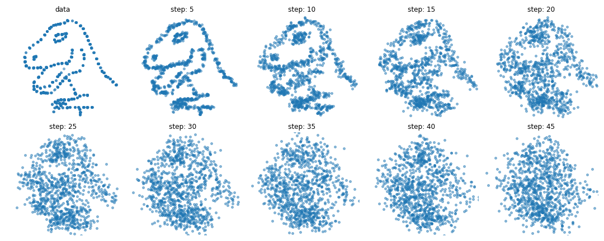

# Diffusion Models : From 2D Toy Datasets to MNIST

Ce dépôt explore le fonctionnement, l'implémentation et la mise à l'échelle des modèles de diffusion probabilistes (Denoising Diffusion Probabilistic Models - DDPM). 

Le projet a débuté comme une étude des processus de diffusion sur des distributions de points 2D en reprenant le projet [`tiny-diffusion`](https://github.com/dataflowr/Project-tiny-diffusion) de [dataflowr](https://github.com/dataflowr/notebooks), avant d'être étendu et mis à l'échelle pour générer des images complexes (le dataset MNIST) via des architectures d'état de l'art (U-Net, EMA, Self-Attention) et des techniques de génération contrôlée (Classifier-Free Guidance).

## Le projet

Le dépôt est composé de 3 implémentations des modèles de diffusion :

### 1. Modèles de diffusion sur données 2D (`ddpm.py`)
Ce fichier du projet [`tiny-diffusion`](https://github.com/dataflowr/Project-tiny-diffusion) n'a pas été modifié.  
Il applique la théorie probabiliste et les processus de Markov (Forward/Reverse) sur des datasets géométriques simples en 2D (ex: le *Datasaurus Dozen*).
- **Architecture :** Perceptron Multicouche (MLP) avec des plongements (embeddings) sinusoïdaux en entrée pour capter les hautes fréquences.
- **Résultats :** De nombreuses expérimentations d'ablations ont été menées pour comprendre la sensibilité du modèle aux hyperparamètres (learning rate, nombre d'étapes de diffusion, etc.).
  
  
*(Exemple du processus de diffusion détruisant progressivement l'information).*

### 2. Génération Inconditionnelle sur MNIST (`ddpm_mnist.py`)
L'objectif ici était de passer de la 2D à la vision par ordinateur (images 28x28) en s'alignant sur l'architecture de l'article fondateur DDPM de Ho et al. (2020).
- **Architecture :** Remplacement du MLP par un réseau **U-Net** de 64 canaux.
- **Améliorations de l'État de l'Art :** - Injection d'un *Time Embedding* sinusoïdal dans chaque bloc résiduel.
  - Utilisation de la **Group Normalization** (au lieu de BatchNorm) et ajout de **Dropout (0.1)**.
  - Intégration d'un module de **Self-Attention** au niveau du goulot d'étranglement (bottleneck) pour une compréhension globale de l'image.
- **Stabilité :** Implémentation d'une Moyenne Mobile Exponentielle (**EMA** avec un *decay* de 0.9999) sur les poids du modèle pour stabiliser la qualité de la génération finale.


### 3. Génération Conditionnelle avec CFG (`ddpm_mnist_conditionnal.py`)
La dernière étape consistait à prendre le contrôle du modèle pour lui demander de générer un chiffre spécifique à la demande, en s'appuyant sur les travaux de Ho & Salimans (2021).
- **Architecture :** Ajout d'un *Class Embedding* fusionné mathématiquement au *Time Embedding*.
- **Entraînement :** Implémentation du **Classifier-Free Guidance (CFG)** en remplaçant aléatoirement 10% des étiquettes par une classe "nulle" pendant l'entraînement.
- **Inférence :** Extrapolation du vecteur conditionnel par rapport au vecteur inconditionnel via un paramètre de force (`guidance_scale`) pour garantir la fidélité de la génération.


---

## 🛠️ Utilisation

Clonez ce dépôt et installez les dépendances nécessaires (PyTorch, Torchvision, Matplotlib, Tqdm, Numpy).


### Lancer les entraînements

**1. tiny-diffusion (2D)**

```bash
python ddpm.py --dataset dino --num_epochs 200
```

**2. MNIST Inconditionnel**

```bash
python ddpm_mnist.py --experiment_name "mnist_unet" --num_epochs 50 --hidden_channels 64
```

**3. MNIST Conditionnel (CFG)**

```bash
python ddpm_mnist_conditionnal.py --experiment_name "mnist_cond" --num_epochs 40 --guidance_scale 2.0
```

---

## 📚 Références et Bibliographie

Ce projet s'appuie sur la théorie et les implémentations décrites dans les publications et dépôts suivants :

* **Le projet initial 2D :** Projet original [*tiny-diffusion* par dataflowr](https://github.com/dataflowr/Project-tiny-diffusion).
* **Le document fondateur (DDPM) :** Ho, J., Jain, A., & Abbeel, P. (2020). *Denoising Diffusion Probabilistic Models*. NeurIPS. ([arXiv:2006.11239](https://arxiv.org/abs/2006.11239))
* **Le conditionnement (CFG) :** Ho, J., & Salimans, T. (2021). *Classifier-Free Diffusion Guidance*. NeurIPS Workshop. ([arXiv:2207.12598](https://arxiv.org/abs/2207.12598))
* **Architectures de référence :** 
  * Ronneberger, O. et al. (2015). *U-Net: Convolutional Networks for Biomedical Image Segmentation*.
  * Vaswani, A. et al. (2017). *Attention is all you need*. (Pour l'implémentation du module de Self-Attention).
  * Wu, Y., & He, K. (2018). *Group Normalization*.
* **Inspirations pour l'implémentation PyTorch :**
  * La structure du code est entièrement basée sur le projet [*tiny-diffusion*](https://github.com/dataflowr/Project-tiny-diffusion). J'ai repris leur projet et y ait effectué les ajouts désirés.
  * Implémentation DDPM par [lucidrains](https://github.com/lucidrains/denoising-diffusion-pytorch).
  * Bibliothèque `diffusers` par [Hugging Face](https://github.com/huggingface/diffusers).